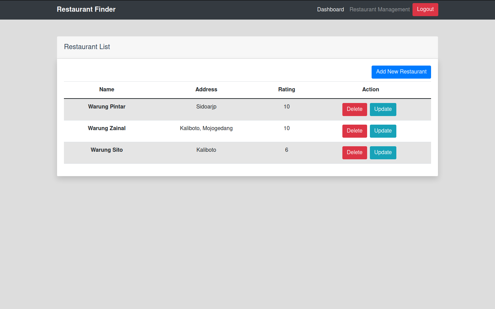
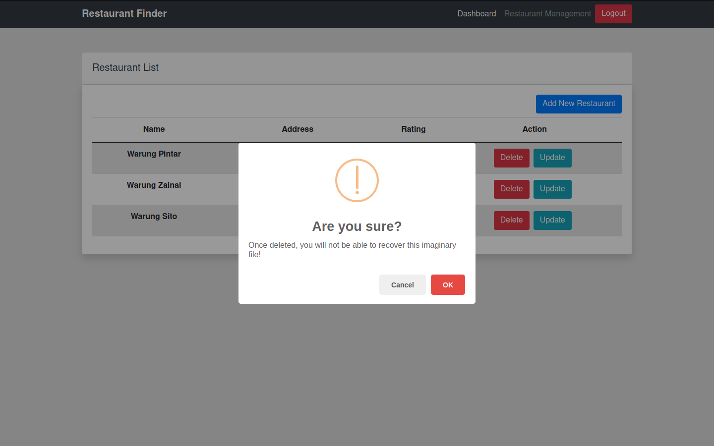

# Restaurant-Finder-With-Laravel-Vue
Restaurant-Finder is an Simple application about Restaurant management &amp; Find Restaurant using Laravel as Backend &amp; Vue JS as Frontend


## Overview





##  API Documentation

### Authentication Endpoint

| Path                      | Method | Description                                  | Data                                                                                             |
| ------------------------- | ------ | -------------------------------------------- | ------------------------------------------------------------------------------------------------ |
| /api/v1/login           | POST   | used for user login / authentication.        | Body Request :<br>email: string, username: string                                                |
| /api/v1/logout          | POST   | used for logout or destroy the user session. | Header Request :<br>Authorization: string                                                        |

### Reataurant Endpoint

| Path          | Method | Description                                 | Data                                                                                                                                                                                                                        |
| ------------- | ------ | ------------------------------------------- | --------------------------------------------------------------------------------------------------------------------------------------------------------------------------------------------------------------------------- |
| /api/v1/restuarant     | GET    | used for show list of restaurant.  | -                                                                                                                                                                                                                           |
| /api/v1/restuarant/:id | GET    | used for show detail  restaurant | Params Request :<br>id: integer                                                                                                                                                                                             |
| /api/v1/restaurant     | POST   | used for create new restaurant     | Header Request :<br>Authorization: string<br><br>Body Request :<br>name: string, address: integer, rating:integer                                           |
| /api/v1/update/restaurant/:id | PATCH  | used for update restaurant         | Header Request : <br>Authorization: string <br><br>Params Request :<br>id: integer<br><br>Body Request :<br>name: string, address: integer, rating:integer |
| /api/v1/delete/restaurant/:id | DELETE | used for delete restaurant        | Header Request : <br>Authorization: string <br><br>Params Request :<br>id: integer |


## Instalation backend API Service

-   clone the project.

```
git clone https://github.com/Zainal21/Restaurant-Finder-With-Laravel-Vue
```

-   Move to folder Restaurant-Finder-Server

````
cd Restaurant-Finder-Server
````

-  install dependency 

```
composer install
```
- Migrate Database
```
php artisan migrate --seed
```

- Create JWT Secret Key
```
php artisan jwt:secret
```

- Change env.example to .env 

```
cp .env.example to .env
```

- Generate Secret Key Laravel 
```
php artisan key:generate
```

- Run laravel project
```
php artisan serve
```

## Instalation Client Service

## Project setup
```
npm install
```

### Compiles and hot-reloads for development
```
npm run serve
```

### Compiles and minifies for production
```
npm run build
```

### Lints and fixes files
```
npm run lint
```

